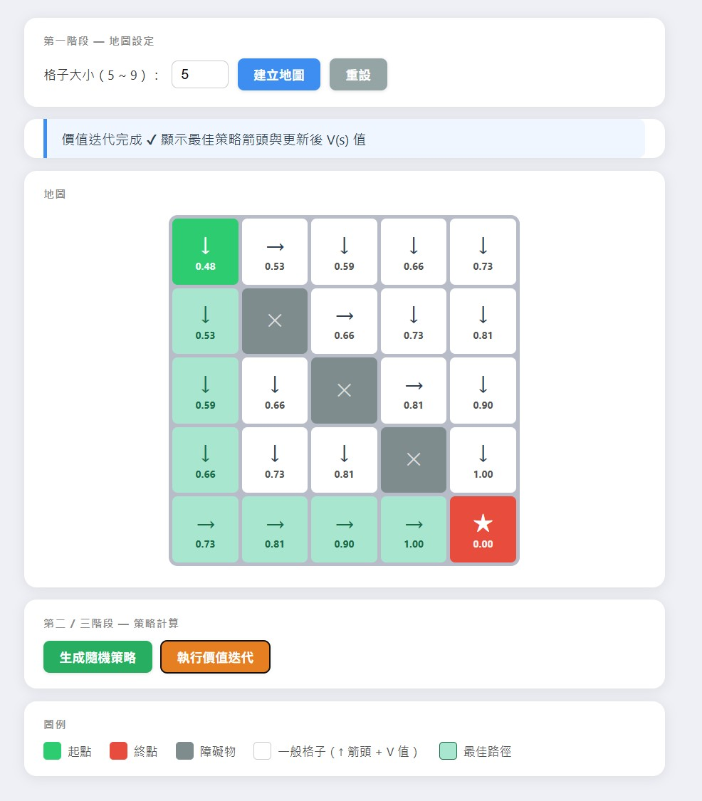

# 強化學習互動網頁應用

互動式網格地圖，視覺化展示隨機策略評估（Policy Evaluation）與價值迭代（Value Iteration）兩種強化學習演算法。

🔗 **[線上 Demo](https://gridworld-takehome.onrender.com)**（免費方案閒置後會睡眠，首次開啟請等待約 30~60 秒喚醒）

---

## 功能展示

| 階段 | 說明 |
|------|------|
| 地圖設定 | 自訂 5×5 ～ 9×9 網格，點擊依序設定起點、終點、障礙物 |
| 隨機策略 | 對每格隨機指派方向，執行 Policy Evaluation 計算 V(s) |
| 價值迭代 | 執行 Value Iteration 求最佳策略，並標示最佳路徑（綠色） |

## 畫面截圖



## 快速開始

```bash
git clone https://github.com/your-username/rl-grid-app.git
cd rl-grid-app
pip install -r requirements.txt
python app.py
```

開啟瀏覽器 → `http://127.0.0.1:5000`

## 操作步驟

1. 輸入格子大小（5～9），按「建立地圖」
2. 依提示依序點擊格子：起點 → 終點 → 障礙物（共 n-2 個）
3. 按「生成隨機策略」查看 Policy Evaluation 結果
4. 按「執行價值迭代」查看最佳策略與路徑

## 演算法細節

- 折扣因子 γ = 0.9
- 到達終點獎勵 = +1，其餘 = 0
- 撞牆或撞障礙物停在原地
- 收斂條件：delta < 1e-4

## 技術棧

- **後端**：Python / Flask
- **前端**：HTML + CSS + JavaScript（原生，無框架）
- **部署**：Render.com

## 專案結構

```
rl-grid-app/
├── app.py              # Flask 後端 + RL 計算邏輯
├── templates/
│   └── index.html      # 前端 UI
├── static/
│   └── style.css
├── requirements.txt
└── render.yaml         # Render 部署設定
```
